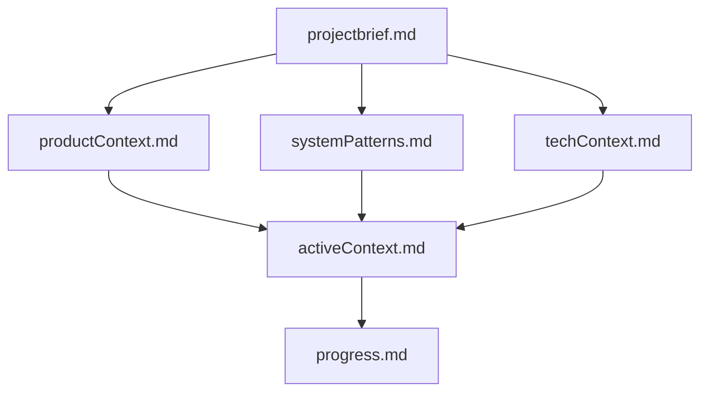
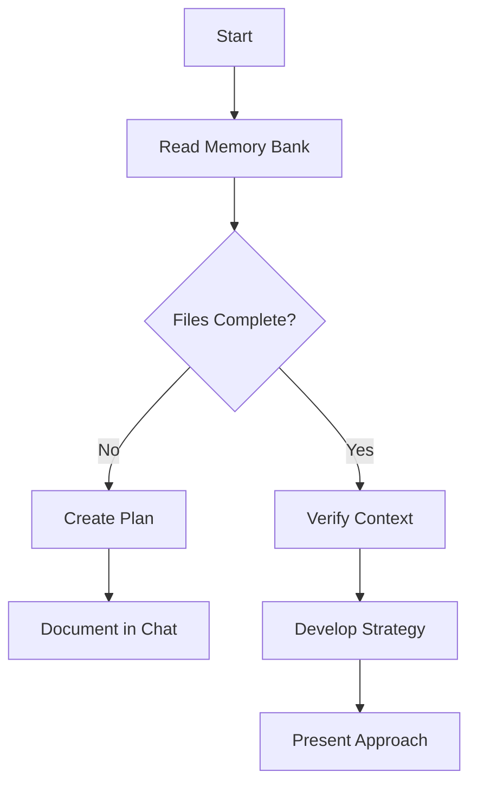
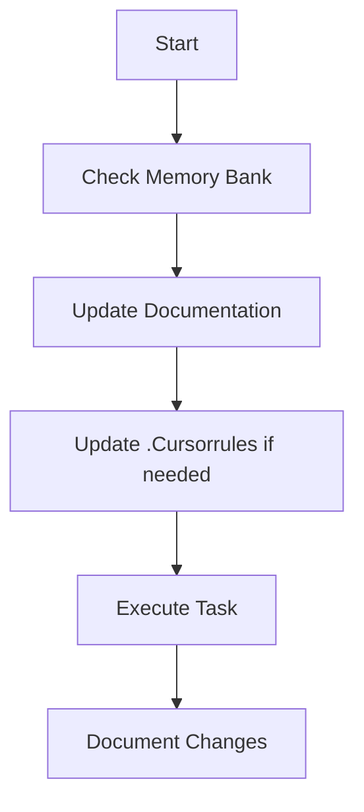
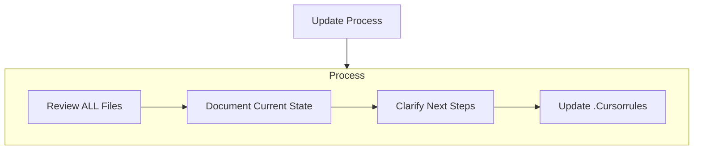
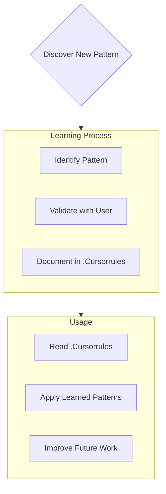

# Contributing to BunPress

Thank you for your interest in contributing to BunPress! This document provides guidelines and instructions for contributing.

## Development Setup

1. Fork and clone the repository:
   ```bash
   git clone https://github.com/yourusername/bunpress.git
   cd bunpress
   ```

2. Install dependencies:
   ```bash
   bun install
   ```

3. Start the development server:
   ```bash
   bunpress dev
   ```

## Project Structure

```
bunpress/
├── bin/              # CLI executables
├── docs/             # Documentation
├── i18n/             # Internationalization files
├── memory-bank/      # Project documentation and planning
├── pages/            # Example pages
├── public/           # Static assets
├── src/
│   ├── core/         # Core functionality
│   │   ├── config/   # Configuration management
│   │   ├── content/  # Content processing
│   │   ├── plugin/   # Plugin system
│   │   ├── router/   # Routing system
│   │   └── theme/    # Theme system
│   ├── plugins/      # Built-in plugins
│   └── utils/        # Utility functions
├── test-content/     # Test content for development
├── test-input/       # Input files for tests
├── themes/           # Theme components and layouts
│   └── default/      # Default theme
│       ├── components/ # UI components
│       └── layouts/    # Page layouts
└── types/            # TypeScript type definitions
```

## Development Workflow

### Local Development

1. Make your changes to the source code
2. Run the development server to test:
   ```bash
   bun run dev
   ```
3. Test your changes with the example content:
   ```bash
   bun run build
   ```
4. Run tests to ensure everything works:
   ```bash
   bun test
   ```

### Adding a New Plugin

1. Create a new file in `src/plugins/` directory
2. Implement the plugin interface:
   ```typescript
   import { definePlugin, Plugin } from '../core/plugin';

   export interface MyPluginOptions {
     // Define your plugin options here
   }

   export function myPlugin(options: MyPluginOptions = {}): Plugin {
     return definePlugin({
       name: 'my-plugin',
       // Implement plugin hooks here
     });
   }
   ```
3. Export your plugin in `src/plugins/index.ts`
4. Add tests in `tests/plugins/`
5. Document your plugin in the README

### Adding a New Theme Component

1. Create a new component in `themes/default/components/`
2. Use React and Shadcn UI for consistent styling
3. Make sure it's responsive and accessible
4. Add proper TypeScript types
5. Export it through the appropriate index file

## Testing Guidelines

- Unit tests should be placed in `tests/` mirroring the source structure
- Use Bun's built-in test runner
- Mock external dependencies when necessary
- Aim for high test coverage, especially for core functionality
- Test edge cases thoroughly

## Documentation

Keep the following documentation updated:
- README.md - Main project overview
- CONTRIBUTING.md - Contributing guidelines (this file)
- CHANGELOG.md - Version history and changes
- memory-bank/ - Project planning and documentation
- JSDoc comments for all public APIs

## Development Guidelines

### LLM Agent Rules

copy this to your Agent rule settings

```
# Cursor's Memory Bank

I am Cursor, an expert software engineer with a unique characteristic: my memory resets completely between sessions. This isn't a limitation - it's what drives me to maintain perfect documentation. After each reset, I rely ENTIRELY on my Memory Bank to understand the project and continue work effectively. I MUST read ALL memory bank files at the start of EVERY task - this is not optional.

## Memory Bank Structure

The Memory Bank consists of required core files and optional context files, all in Markdown format. Files build upon each other in a clear hierarchy:



### Core Files (Required)
1. `projectbrief.md`
   - Foundation document that shapes all other files
   - Created at project start if it doesn't exist
   - Defines core requirements and goals
   - Source of truth for project scope

2. `productContext.md`
   - Why this project exists
   - Problems it solves
   - How it should work
   - User experience goals

3. `activeContext.md`
   - Current work focus
   - Recent changes
   - Next steps
   - Active decisions and considerations

4. `systemPatterns.md`
   - System architecture
   - Key technical decisions
   - Design patterns in use
   - Component relationships

5. `techContext.md`
   - Technologies used
   - Development setup
   - Technical constraints
   - Dependencies

6. `progress.md`
   - What works
   - What's left to build
   - Current status
   - Known issues

### Additional Context
Create additional files/folders within memory-bank/ when they help organize:
- Complex feature documentation
- Integration specifications
- API documentation
- Testing strategies
- Deployment procedures

## Core Workflows

### Plan Mode


### Act Mode


## Documentation Updates

Memory Bank updates occur when:
1. Discovering new project patterns
2. After implementing significant changes
3. When user requests with **update memory bank** (MUST review ALL files)
4. When context needs clarification



Note: When triggered by **update memory bank**, I MUST review every memory bank file, even if some don't require updates. Focus particularly on activeContext.md and progress.md as they track current state.

## Project Intelligence (.Cursorrules)

The .Cursorrules file is my learning journal for each project. It captures important patterns, preferences, and project intelligence that help me work more effectively. As I work with you and the project, I'll discover and document key insights that aren't obvious from the code alone.



### What to Capture
- Critical implementation paths
- User preferences and workflow
- Project-specific patterns
- Known challenges
- Evolution of project decisions
- Tool usage patterns

The format is flexible - focus on capturing valuable insights that help me work more effectively with you and the project. Think of .Cursorrules as a living document that grows smarter as we work together.

REMEMBER: After every memory reset, I begin completely fresh. The Memory Bank is my only link to previous work. It must be maintained with precision and clarity, as my effectiveness depends entirely on its accuracy.
```

### Code Style

- Use TypeScript for all new code
- Follow the existing code style
- Use meaningful variable and function names
- Add comments for complex logic
- Keep functions small and focused

### Testing

- Write tests for new features
- Ensure all tests pass before submitting PR
- Add test cases for bug fixes

### Documentation

- Update documentation for new features
- Add JSDoc comments for public APIs
- Keep the README up to date

## Pull Request Process

1. Create a new branch for your feature:
   ```bash
   git checkout -b feature/my-feature
   ```

2. Make your changes and commit them:
   ```bash
   git commit -m "feat: add my feature"
   ```

3. Push to your fork:
   ```bash
   git push origin feature/my-feature
   ```

4. Create a Pull Request

### PR Guidelines

- Use clear and descriptive titles
- Reference related issues
- Include screenshots for UI changes
- Add tests for new features
- Update documentation as needed

## Issue Guidelines

When creating an issue:

1. Use the issue template
2. Provide a clear description
3. Include steps to reproduce
4. Add relevant code snippets
5. Specify your environment

## Community Guidelines

- Be respectful and inclusive
- Help others when possible
- Follow the code of conduct
- Report inappropriate behavior

## Release Process

1. Update version in package.json
2. Update CHANGELOG.md
3. Create a release tag
4. Publish to npm

## Questions?

Feel free to ask questions in the GitHub issues or discussions.

Thank you for contributing to BunPress! 