# System Patterns

## Architecture Principles
1. **Component-Based**: Building with small, composable components
2. **Functional Core**: Pure functions for core operations
3. **Explicit Dependencies**: Clear dependency injection
4. **Plugin-Based Extensibility**: Keeping core lightweight with plugin-based architecture
5. **Static Generation Focus**: Prioritizing static site generation for optimal performance
6. **Bun-First Approach**: Optimizing for Bun's runtime capabilities

## Project Structure
```
bunpress/
├── src/                     # Source code
│   ├── core/               # Core functionality
│   │   ├── plugin.ts       # Plugin system
│   │   ├── content-processor.ts # Content processor
│   │   ├── dev-server.ts   # Development server
│   │   ├── router.ts       # Routing system
│   │   ├── renderer.ts     # HTML rendering
│   │   ├── builder.ts      # Static site builder
│   │   ├── config-loader.ts # Configuration loader
│   │   ├── index.ts        # Core exports
│   │   └── __tests__/      # Core tests
│   ├── plugins/            # Built-in plugins
│   │   ├── markdown-it/    # Markdown-it plugin
│   │   ├── prism/          # Prism.js syntax highlighting
│   │   └── index.ts        # Plugin exports
│   ├── lib/                # Utility functions
│   │   └── utils.ts        # Utility functions
│   ├── config.ts           # Config and plugin definition helpers
│   ├── lib.ts              # Library exports
│   └── index.ts            # CLI and package entry point
├── bin/                    # Binary executables
│   └── bunpress.js         # CLI entry point
├── dist/                   # Compiled code (generated)
├── types/                  # TypeScript declarations (generated)
├── pages/                  # Content pages (user project)
├── public/                 # Static assets (user project)
└── bunpress.config.ts     # User configuration
```

## Package Structure

```
npm package structure:
├── dist/                  # Compiled JavaScript
│   ├── core/
│   ├── plugins/
│   └── index.js           # Entry point
├── types/                 # TypeScript declarations
│   ├── core/
│   ├── plugins/
│   └── index.d.ts
├── bin/
│   └── bunpress.js        # CLI executable
├── README.md              # Documentation
└── package.json           # Package metadata
```

## Export Structure

```javascript
// Main exports
import { defineConfig, definePlugin } from 'bunpress';
import { buildSite, loadConfig } from 'bunpress/core';
import { markdownItPlugin, prismPlugin } from 'bunpress/plugins';
```

## Plugin System Architecture

### Core Components
1. **Plugin Interface**: Defines the contract for plugins
   - `name`: Unique identifier for the plugin
   - `options`: Configuration options
   - Lifecycle hooks: `buildStart`, `buildEnd`
   - Content transformers: `transform`
   - Server hooks: `configureServer`

2. **Plugin Manager**: Manages the plugin lifecycle
   - Adding, removing, and retrieving plugins
   - Executing plugin hooks in sequence
   - Managing plugin dependencies
   - Error handling for plugin failures

3. **Content Processor**: Integrates with plugins to transform content
   - Runs content through plugin transform functions
   - Maintains transformation pipeline
   - Manages content metadata

4. **Build System**: Integrates with plugins for build lifecycle
   - Executes `buildStart` hooks before build
   - Executes `buildEnd` hooks after build
   - Provides build context to plugins
   - Coordinates plugin execution order

### Provided Plugins

1. **Markdown-It Plugin**
   - Configures the Markdown-It processor
   - Adds custom syntax and extensions
   - Provides hooks for customizing the Markdown rendering

2. **Prism.js Plugin**
   - Provides code syntax highlighting
   - Supports various languages and themes
   - Integrates with Markdown content transformation

3. **Image Optimizer Plugin**
   - Converts images to modern formats (WebP, AVIF)
   - Generates responsive image sizes
   - Compresses images for better performance
   - Updates image references in content
   - Hooks into the build process for asset processing

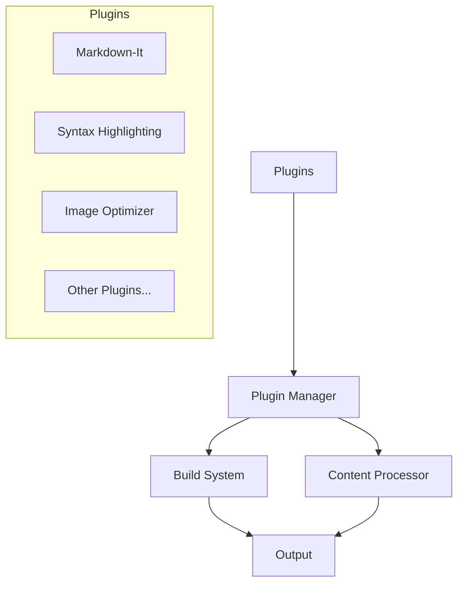
```mermaid
graph TD
    P[Plugins] --> PM[Plugin Manager]
    PM --> B[Build System]
    PM --> C[Content Processor]
    B --> O[Output]
    C --> O
    
    subgraph Plugins
        M[Markdown-It]
        H[Syntax Highlighting]
        I[Image Optimizer]
        S[Other Plugins...]
    end
```

### Plugin Execution Flow

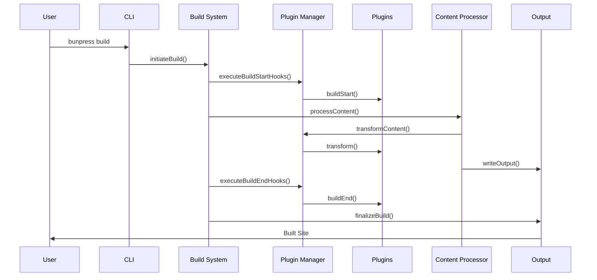
```mermaid
sequenceDiagram
    participant U as User
    participant C as CLI
    participant B as Build System
    participant PM as Plugin Manager
    participant P as Plugins
    participant CP as Content Processor
    participant O as Output

    U->>C: bunpress build
    C->>B: initiateBuild()
    B->>PM: executeBuildStartHooks()
    PM->>P: buildStart()
    B->>CP: processContent()
    CP->>PM: transformContent()
    PM->>P: transform()
    CP->>O: writeOutput()
    B->>PM: executeBuildEndHooks()
    PM->>P: buildEnd()
    B->>O: finalizeBuild()
    O->>U: Built Site
```

### Image Optimizer Plugin Flow

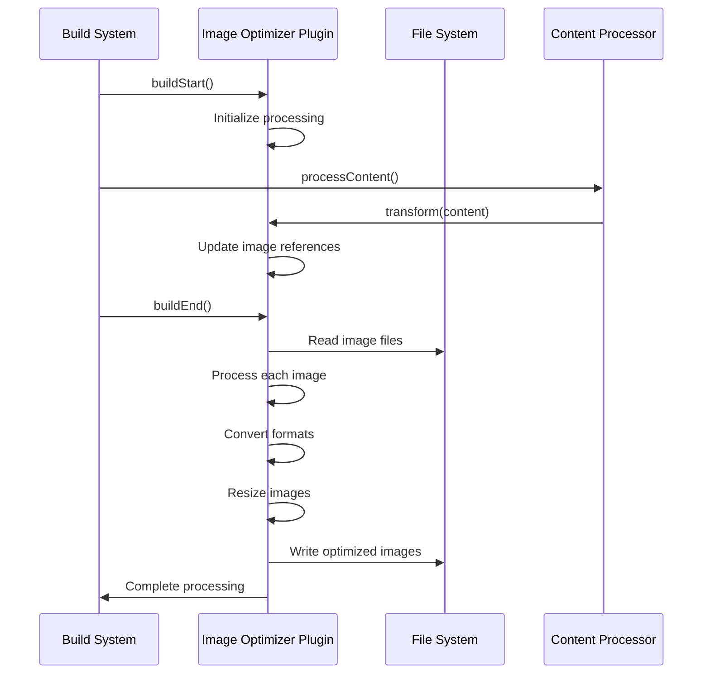
```mermaid
sequenceDiagram
    participant B as Build System
    participant IO as Image Optimizer Plugin
    participant FS as File System
    participant CP as Content Processor

    B->>IO: buildStart()
    IO->>IO: Initialize processing
    B->>CP: processContent()
    CP->>IO: transform(content)
    IO->>IO: Update image references
    B->>IO: buildEnd()
    IO->>FS: Read image files
    IO->>IO: Process each image
    IO->>IO: Convert formats
    IO->>IO: Resize images
    IO->>FS: Write optimized images
    IO->>B: Complete processing
```

## CLI Architecture

```
CLI Command Structure:
bunpress init          # Initialize a new project
bunpress dev           # Start development server
bunpress build         # Build for production
bunpress help          # Display help information
```

### Design Patterns
1. Plugin Pattern
   - Extensible architecture for adding functionality
   - Lifecycle hooks for build process
   - Content transformation pipeline
   - Server configuration extension

2. Manager Pattern
   - Centralized plugin management
   - Ordered execution of hooks
   - Async operation support
   - Type-safe plugin options

3. Pipeline Pattern
   - Content passes through multiple transforms
   - Each plugin modifies or enhances content
   - Sequential processing with dependency ordering

4. Factory Pattern
   - Plugin creation through factory functions
   - Configuration-based instantiation
   - Consistent interface implementation

5. Command Pattern
   - CLI command routing (init, dev, build, help)
   - Consistent interface for all commands
   - Plugin lifecycle hooks for different commands

### Component Relationships
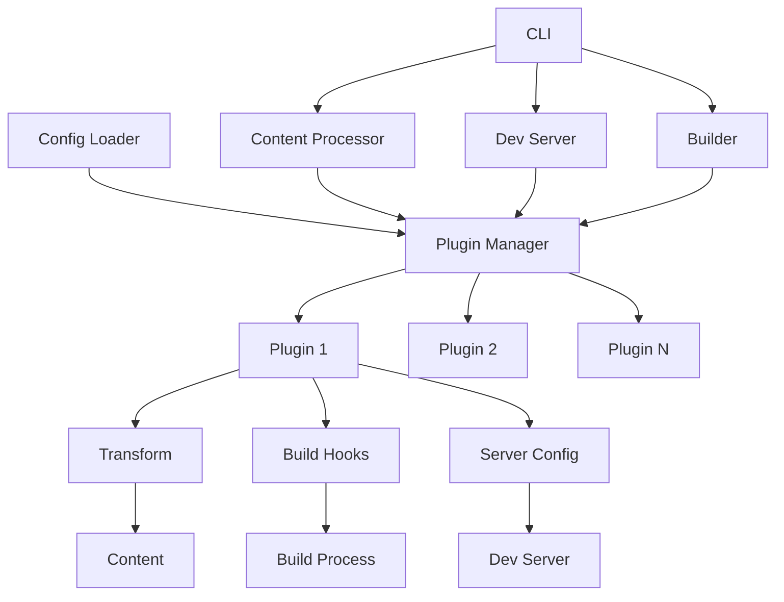
```mermaid
graph TD
    A[Config Loader] --> B[Plugin Manager]
    B --> C[Plugin 1]
    B --> D[Plugin 2]
    B --> E[Plugin N]
    
    F[Content Processor] --> B
    G[Dev Server] --> B
    H[Builder] --> B
    
    C --> I[Transform]
    C --> J[Build Hooks]
    C --> K[Server Config]
    
    I --> L[Content]
    J --> M[Build Process]
    K --> N[Dev Server]
    
    O[CLI] --> F
    O --> G
    O --> H
```

## Content Processing Architecture

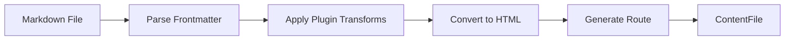
```mermaid
graph LR
    A[Markdown File] --> B[Parse Frontmatter]
    B --> C[Apply Plugin Transforms]
    C --> D[Convert to HTML]
    D --> E[Generate Route]
    E --> F[ContentFile]
```

## Build System Architecture

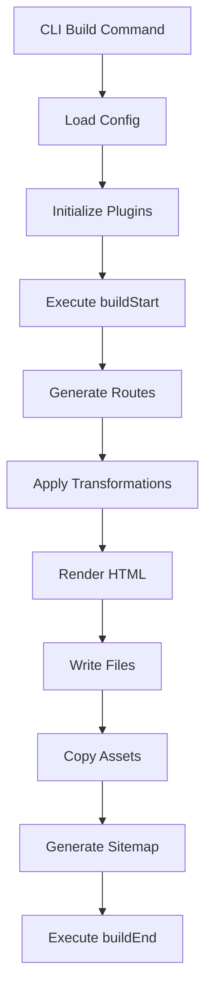
```mermaid
graph TD
    A[CLI Build Command] --> B[Load Config]
    B --> C[Initialize Plugins]
    C --> D[Execute buildStart]
    D --> E[Generate Routes]
    E --> F[Apply Transformations]
    F --> G[Render HTML]
    G --> H[Write Files]
    H --> I[Copy Assets]
    I --> J[Generate Sitemap]
    J --> K[Execute buildEnd]
```

## Package Publishing Flow

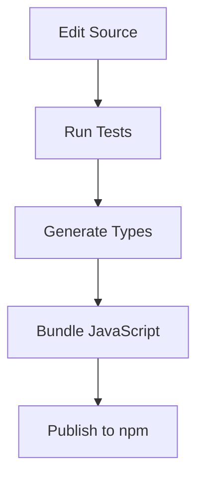
```mermaid
graph TD
    A[Edit Source] --> B[Run Tests]
    B --> C[Generate Types]
    C --> D[Bundle JavaScript]
    D --> E[Publish to npm]
```

## Key Technical Decisions
1. Async/await for all plugin hooks
2. Ordered execution of transform hooks
3. Type-safe plugin options
4. Unique plugin names
5. Extensible plugin interface
6. Content processor integration with plugins
7. Configuration-based plugin loading
8. CLI command pattern for dev/build operations
9. Build system integration with plugin lifecycle hooks
10. Bun-first design approach
11. ESM-only package structure

## Architecture Overview
BunPress follows a modular architecture with clear separation of concerns:

```
Core Engine
    ├── Server (Bun's server)
    ├── Bundler (Bun's bundler) 
    ├── File Watcher (Bun's file watcher)
    └── Content Processor (Markdown/MDX parsing)

Plugins System
    ├── Plugin Manager
    └── Plugin Hooks

Theme System
    ├── Layout Components
    └── Shadcn UI Integration

Routing
    └── File-based Router
```

## Core Patterns

### 1. File-Based Routing
- Routes are determined by the file structure in the `pages/` directory
- File paths directly map to URL paths
- Special files (e.g., `index.md`) map to root routes

### 2. Content Processing Pipeline
```
Markdown/MDX File → Parse Frontmatter → Process Content → Apply Layout → Generate HTML
```

### 3. Plugin System Architecture
- Plugin manager initializes and manages plugins
- Plugins hook into specific lifecycle events:
  - `transform`: Transform content during processing
  - `buildStart`: Execute at the beginning of build
  - `buildEnd`: Execute at the end of build
  - `configureServer`: Modify the development server

### 4. Theme System
- Themes define layouts and styles for the site
- Default theme built with Shadcn UI components
- Theme components receive page content and metadata as props

## Component Relationships

### Development Server Flow
```
Start Server → Watch Files → Process Changes → Hot Module Replace
```

### Build Process Flow
```
Scan Pages → Parse Content → Apply Transforms → Render HTML → Bundle Assets → Generate SEO Files
```

## Key Technical Decisions

1. **Bun as the Foundation**: Utilizing Bun's server, bundler, and file watcher for core functionality
2. **MDX Support**: Extending Markdown with JSX capabilities using a lightweight approach
3. **Shadcn for UI**: Using Shadcn as the default component library for theme development
4. **Plugin-Based Extensibility**: Keeping core lightweight with plugin-based architecture
5. **Static Generation Focus**: Prioritizing static site generation for optimal performance 

## Plugin System Architecture

### Core Components
1. Plugin Interface
   ```typescript
   interface Plugin {
     name: string;
     options?: Record<string, unknown>;
     transform?: (content: string) => string | Promise<string>;
     buildStart?: () => Promise<void>;
     buildEnd?: () => Promise<void>;
     configureServer?: (server: any) => Promise<void>;
   }
   ```

2. Plugin Manager
   ```typescript
   interface PluginManager {
     plugins: Plugin[];
     addPlugin: (plugin: Plugin) => void;
     removePlugin: (name: string) => void;
     getPlugin: (name: string) => Plugin | undefined;
     executeTransform: (content: string) => Promise<string>;
     executeBuildStart: () => Promise<void>;
     executeBuildEnd: () => Promise<void>;
     executeConfigureServer: (server: any) => Promise<void>;
   }
   ```

### Design Patterns
1. Plugin Pattern
   - Extensible architecture for adding functionality
   - Lifecycle hooks for build process
   - Content transformation pipeline
   - Server configuration extension

2. Manager Pattern
   - Centralized plugin management
   - Ordered execution of hooks
   - Async operation support
   - Type-safe plugin options

### Component Relationships
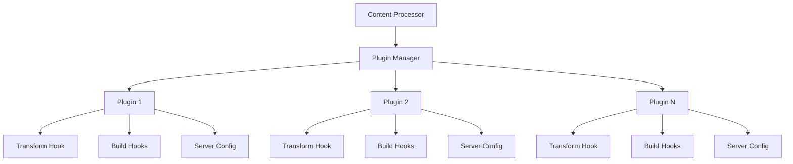
```mermaid
graph TD
    A[Content Processor] --> B[Plugin Manager]
    B --> C[Plugin 1]
    B --> D[Plugin 2]
    B --> E[Plugin N]
    
    C --> F[Transform Hook]
    C --> G[Build Hooks]
    C --> H[Server Config]
    
    D --> I[Transform Hook]
    D --> J[Build Hooks]
    D --> K[Server Config]
    
    E --> L[Transform Hook]
    E --> M[Build Hooks]
    E --> N[Server Config]
```

## Key Technical Decisions
1. Async/await for all plugin hooks
2. Ordered execution of transform hooks
3. Type-safe plugin options
4. Unique plugin names
5. Extensible plugin interface 

## Overall Architecture

BunPress follows a modular architecture with a strong emphasis on extensibility through plugins. The core system handles content processing, routing, and build pipeline, while plugins extend functionality through well-defined hooks.

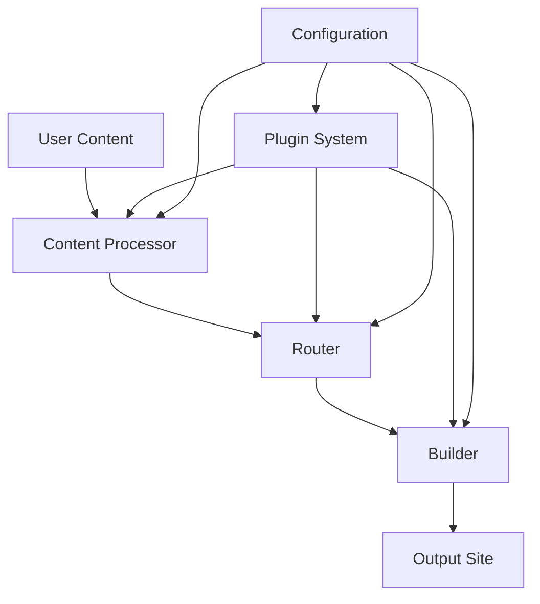
```mermaid
flowchart TD
    User[User Content] --> ContentProcessor[Content Processor]
    ContentProcessor --> Router[Router]
    Router --> Builder[Builder]
    Builder --> Output[Output Site]
    
    Plugins[Plugin System] --> ContentProcessor
    Plugins --> Router
    Plugins --> Builder
    
    Config[Configuration] --> ContentProcessor
    Config --> Router
    Config --> Builder
    Config --> Plugins
```

## Core Components

### Content Processor

Responsible for processing Markdown files:
- Reads files from the `content` directory
- Parses frontmatter metadata
- Renders Markdown content to HTML
- Applies plugin transformations

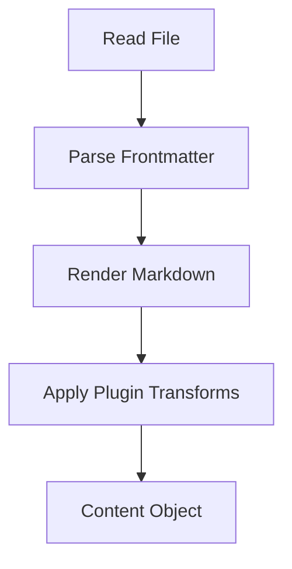
```mermaid
flowchart TD
    ReadFile[Read File] --> ParseFrontmatter[Parse Frontmatter]
    ParseFrontmatter --> RenderMarkdown[Render Markdown]
    RenderMarkdown --> ApplyTransforms[Apply Plugin Transforms]
    ApplyTransforms --> OutputContent[Content Object]
```

### Router

Handles the creation of routes based on the file structure:
- Maps content files to routes
- Supports nested routing
- Handles dynamic routes
- Integrates with the content processor

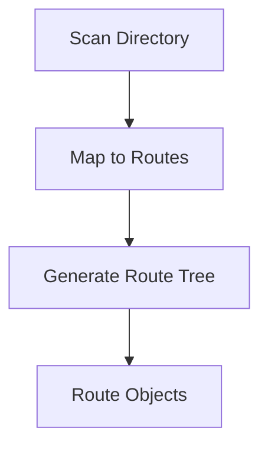
```mermaid
flowchart TD
    ScanDir[Scan Directory] --> MapRoutes[Map to Routes]
    MapRoutes --> GenerateTreeStructure[Generate Route Tree]
    GenerateTreeStructure --> Output[Route Objects]
```

### Builder

Manages the build process:
- Initializes plugin system
- Coordinates build lifecycle
- Transforms content with plugins
- Generates final output

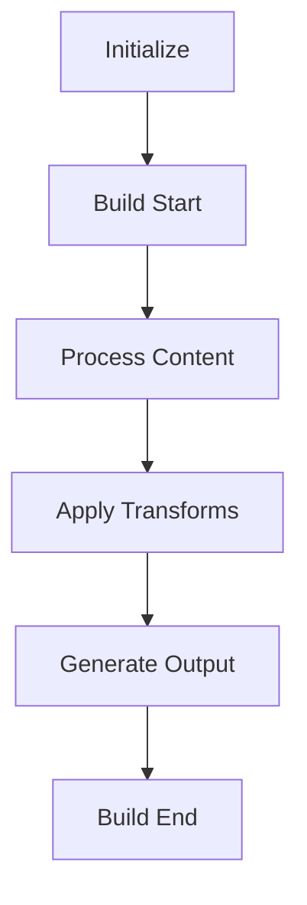
```mermaid
flowchart TD
    Init[Initialize] --> BuildStart[Build Start]
    BuildStart --> ProcessContent[Process Content]
    ProcessContent --> ApplyTransforms[Apply Transforms]
    ApplyTransforms --> GenerateOutput[Generate Output]
    GenerateOutput --> BuildEnd[Build End]
```

## Plugin System

The plugin system is the primary extension mechanism for BunPress. Plugins can interact with the system at various points in the content lifecycle.

### Plugin Lifecycle Hooks

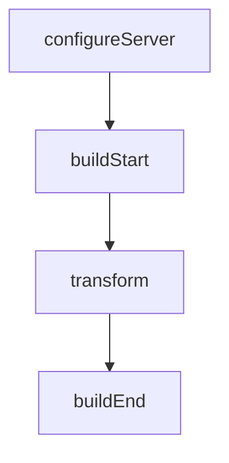
```mermaid
flowchart TD
    configureServer[configureServer] --> buildStart[buildStart]
    buildStart --> transform[transform]
    transform --> buildEnd[buildEnd]
```

1. **configureServer**: Set up development server functionality
2. **buildStart**: Initialize at the beginning of a build
3. **transform**: Transform content during processing
4. **buildEnd**: Finalize at the end of a build process

### Plugin Interface

```typescript
interface Plugin {
  name: string;
  configureServer?: (server: any) => void;
  buildStart?: (options: BuildOptions) => void | Promise<void>;
  transform?: (content: ContentFile) => ContentFile | Promise<ContentFile>;
  buildEnd?: (options: BuildOptions) => void | Promise<void>;
}
```

## Implemented Plugins

### Markdown-It Plugin

A basic plugin that configures the Markdown-It renderer with various options.

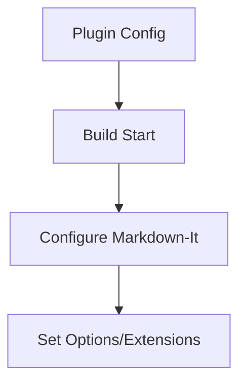
```mermaid
flowchart TD
    Config[Plugin Config] --> BuildStart[Build Start]
    BuildStart --> ConfigureMdIt[Configure Markdown-It]
    ConfigureMdIt --> SetOptions[Set Options/Extensions]
```

### Image Optimizer Plugin

Optimizes images during the build process:

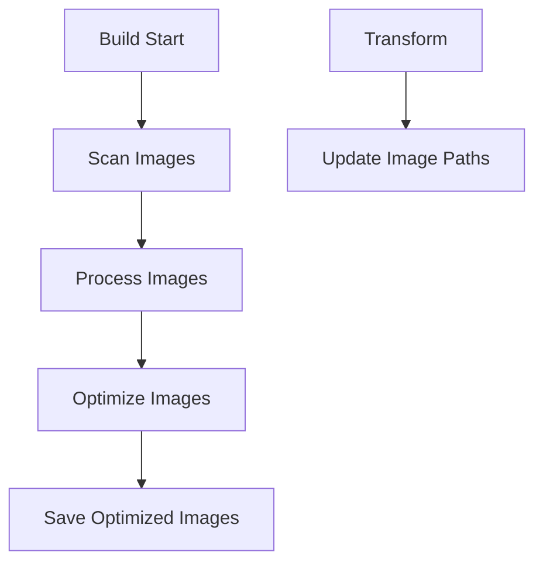
```mermaid
flowchart TD
    BuildStart[Build Start] --> ScanImages[Scan Images]
    ScanImages --> ProcessImages[Process Images]
    ProcessImages --> OptimizeImages[Optimize Images]
    OptimizeImages --> SaveImages[Save Optimized Images]
    
    Transform[Transform] --> UpdateImagePaths[Update Image Paths]
```

### SEO Plugin

Enhances content with SEO metadata:

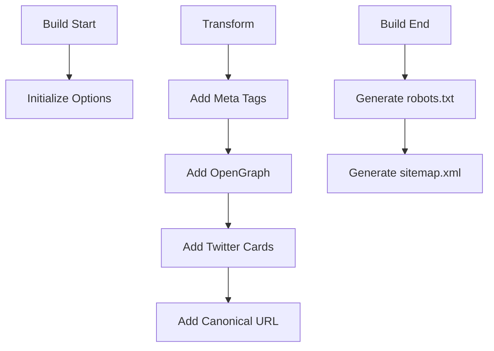
```mermaid
flowchart TD
    BuildStart[Build Start] --> InitializeOptions[Initialize Options]
    
    Transform[Transform] --> AddMetaTags[Add Meta Tags]
    AddMetaTags --> AddOpenGraph[Add OpenGraph]
    AddOpenGraph --> AddTwitterCards[Add Twitter Cards]
    AddTwitterCards --> AddCanonical[Add Canonical URL]
    
    BuildEnd[Build End] --> GenerateRobotsTxt[Generate robots.txt]
    GenerateRobotsTxt --> GenerateSitemap[Generate sitemap.xml]
```

### Prism.js Plugin

Adds syntax highlighting to code blocks:

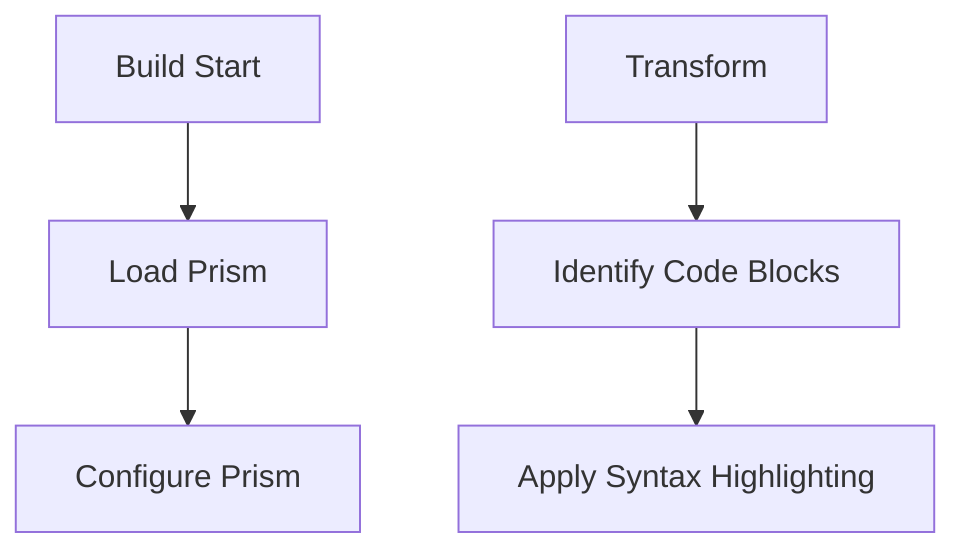
```mermaid
flowchart TD
    BuildStart[Build Start] --> LoadPrism[Load Prism]
    LoadPrism --> ConfigurePrism[Configure Prism]
    
    Transform[Transform] --> IdentifyCodeBlocks[Identify Code Blocks]
    IdentifyCodeBlocks --> ApplySyntaxHighlighting[Apply Syntax Highlighting]
```

### RSS Feed Plugin

Generates RSS feeds for content syndication:

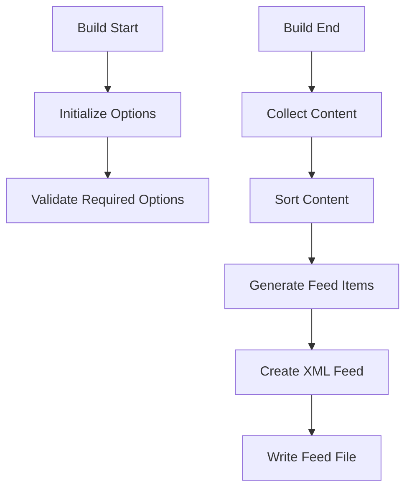
```mermaid
flowchart TD
    BuildStart[Build Start] --> InitializeOptions[Initialize Options]
    InitializeOptions --> ValidateOptions[Validate Required Options]
    
    BuildEnd[Build End] --> CollectContent[Collect Content]
    CollectContent --> SortContent[Sort Content]
    SortContent --> GenerateItems[Generate Feed Items]
    GenerateItems --> CreateXML[Create XML Feed]
    CreateXML --> WriteFile[Write Feed File]
```

The RSS Feed plugin architecture:
- Uses the buildEnd hook to generate feed after all content is processed
- Maintains a collection of content files during the build process
- Generates XML feed with configurable options
- Exposes test helpers through a `__test__` property for testability
- Handles XML escaping and content excerpt generation

## Data Flow

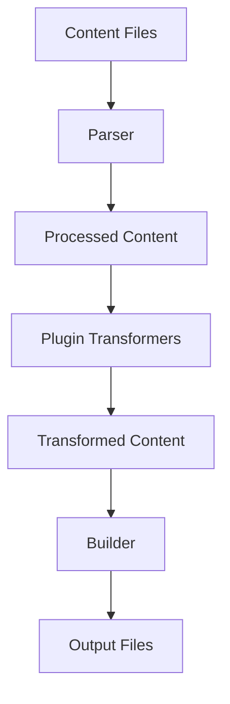
```mermaid
flowchart TD
    Content[Content Files] --> Parser[Parser]
    Parser --> ProcessedContent[Processed Content]
    ProcessedContent --> Transformer[Plugin Transformers]
    Transformer --> TransformedContent[Transformed Content]
    TransformedContent --> Builder[Builder]
    Builder --> OutputFiles[Output Files]
```

## Configuration System

BunPress uses a TypeScript-based configuration system that allows users to:
- Configure site metadata
- Set build options
- Register and configure plugins
- Define theme customization

```typescript
interface BunPressConfig {
  // Site metadata
  title: string;
  description?: string;
  siteUrl?: string;
  
  // Build configuration
  srcDir?: string;
  outDir?: string;
  contentDir?: string;
  
  // Theme configuration
  theme?: ThemeConfig;
  
  // Plugins
  plugins?: Plugin[];
}
```

## Testing Patterns

BunPress implements several testing patterns:

1. **Component Testing**: Isolating components for unit testing
2. **Mock File System**: Using mock implementations for file system operations
3. **Integration Testing**: Testing the interaction between components
4. **Plugin Testing**: Testing plugin functionality with mocks

For plugins that generate content, we use a test helper pattern:

```typescript
interface PluginWithTestHelpers extends Plugin {
  __test__: {
    // Methods that allow testing internal plugin functionality
    addContentFile: (file: ContentFile) => void;
    clearContentFiles: () => void;
    getContentFiles: () => ContentFile[];
    generateOutput: () => string | Buffer;
  }
}
```

This pattern allows tests to control and inspect plugin behavior without relying on file system operations or running the entire build process.

## Common Design Patterns

1. **Factory Pattern**: Used for creating content and route objects
2. **Observer Pattern**: Used in the plugin system for lifecycle hooks
3. **Strategy Pattern**: Used for different processing strategies
4. **Chain of Responsibility**: Used in the transform pipeline
5. **Singleton**: Used for the configuration object
6. **Adapter**: Used to normalize plugin interfaces
7. **Facade**: Used to simplify complex subsystems to plugins 

## Bun Feature Utilization Patterns

To better align with the "Bun-First" approach, we should adopt these architectural patterns:

### HTML-First Pattern
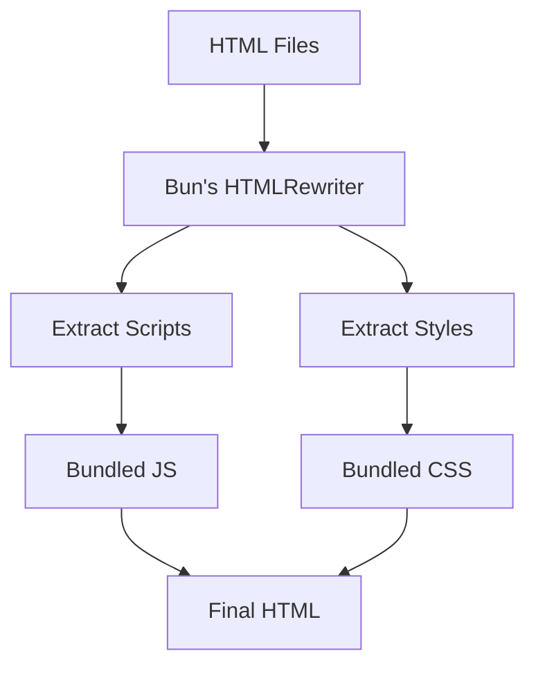
```mermaid
graph TD
    A[HTML Files] --> B[Bun's HTMLRewriter]
    B --> C[Extract Scripts]
    B --> D[Extract Styles]
    C --> E[Bundled JS]
    D --> F[Bundled CSS]
    E --> G[Final HTML]
    F --> G
```

1. **HTML as Entry Point**: Use HTML files directly as entry points for the bundler
2. **Automatic Asset Discovery**: Let Bun scan and detect assets from HTML rather than manual configuration
3. **Path Preservation**: Maintain directory structure from source to output

### CSS Processing Pattern
```mermaid
graph LR
    A[CSS Files] --> B[Bun's CSS Parser]
    B --> C[Process @imports]
    B --> D[Minify]
    B --> E[Transform URLs]
    C --> F[Bundled CSS]
    D --> F
    E --> F
```

1. **CSS Bundle Chunking**: Group related CSS imports to reduce duplicate loading
2. **Asset Path Transformation**: Automatically rewrite asset paths with content hashing
3. **CSS Optimization Pipeline**: Use Bun's native CSS processing for all transformations

### Static Asset Pattern
```mermaid
graph TD
    A[Static Assets] --> B[Copy & Hash]
    B --> C[Update References]
    C --> D[Optimize Size]
    D --> E[Output Directory]
```

1. **Content-Addressable Hashing**: Apply content hashes to enable long-term caching
2. **Size-Based Optimization**: Inline small assets into data: URLs to reduce HTTP requests
3. **Format Optimization**: Convert images to modern formats based on browser support

### Hot Module Replacement Pattern
```mermaid
flowchart TD
    A[File Change] --> B[Detect Module Boundary]
    B --> C{Self-Accepting?}
    C -->|Yes| D[Replace Module]
    C -->|No| E[Find Accepting Parent]
    E --> F{Parent Found?}
    F -->|Yes| G[Replace Parent]
    F -->|No| H[Full Reload]
    D --> I[Update UI]
    G --> I
```

1. **Module Boundary Detection**: Clearly define module boundaries for hot replacement
2. **State Preservation**: Use `import.meta.hot.data` to transfer state between module instances
3. **Graceful Degradation**: Fall back to full page reload when boundary can't be determined

### Build Optimization Pattern
```mermaid
graph TD
    A[Source Files] --> B[Tree Shaking]
    B --> C[Code Splitting]
    C --> D[Minification]
    D --> E[Output Files]
```

1. **Entry Point Analysis**: Identify and optimize entry points based on dependency graph
2. **Shared Chunk Extraction**: Extract common dependencies into shared chunks
3. **Conditional Compilation**: Use environment-based compilation for development vs. production

### Fullstack Integration Pattern
```mermaid
graph LR
    A[Frontend] <--> B[Bun.serve]
    C[Backend] <--> B
    B --> D[Development]
    B --> E[Production Build]
```

1. **Unified Development**: Single server for both frontend and API endpoints
2. **Route-Based Architecture**: Define routes for both static content and API endpoints
3. **Environment Consistency**: Use the same environment for development and production

### Plugin Architecture Pattern
```mermaid
flowchart TD
    A[Config] --> B[Plugin Manager]
    B --> C{Plugin Type}
    C -->|Builder| D[Build Plugins]
    C -->|Transformer| E[Content Plugins]
    C -->|Server| F[Server Plugins]
    D --> G[Build Process]
    E --> H[Content Pipeline]
    F --> I[Dev Server]
```

1. **Bundler Plugin Integration**: Seamless integration with Bun's bundler plugins
2. **Plugin Discovery**: Automatic loading of plugins from configuration
3. **Life-cycle Hooks**: Well-defined hooks for plugins to interact with various stages

Adopting these patterns will ensure BunPress fully leverages Bun's native capabilities and delivers on its promise of exceptional performance and developer experience. 