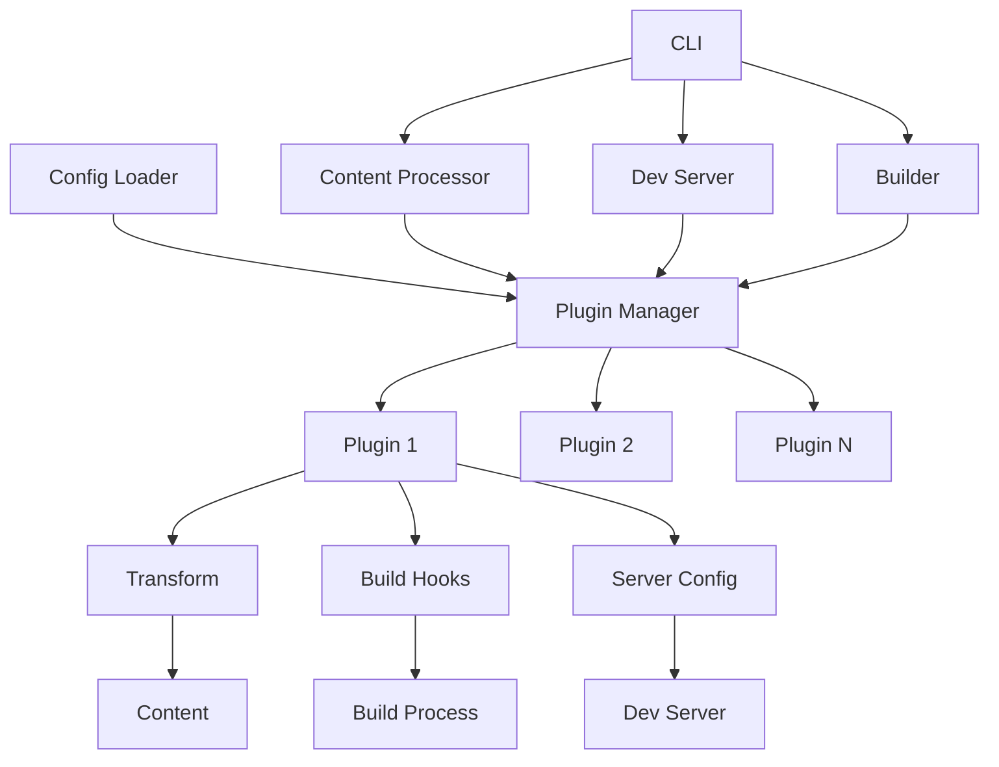
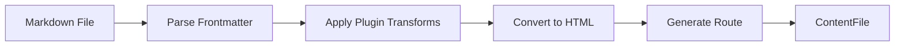
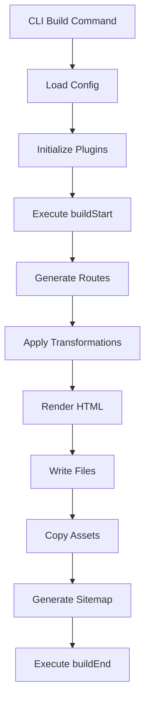
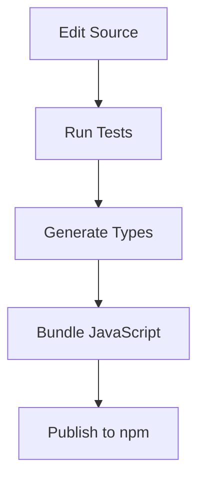
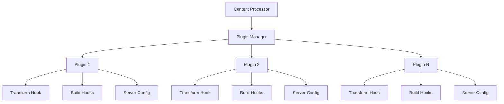

# System Patterns

## Architecture Principles
1. **Component-Based**: Building with small, composable components
2. **Functional Core**: Pure functions for core operations
3. **Explicit Dependencies**: Clear dependency injection
4. **Plugin-Based Extensibility**: Keeping core lightweight with plugin-based architecture
5. **Static Generation Focus**: Prioritizing static site generation for optimal performance
6. **Bun-First Approach**: Optimizing for Bun's runtime capabilities

## Project Structure
```
bunpress/
├── src/                     # Source code
│   ├── core/               # Core functionality
│   │   ├── plugin.ts       # Plugin system
│   │   ├── content-processor.ts # Content processor
│   │   ├── dev-server.ts   # Development server
│   │   ├── router.ts       # Routing system
│   │   ├── renderer.ts     # HTML rendering
│   │   ├── builder.ts      # Static site builder
│   │   ├── config-loader.ts # Configuration loader
│   │   ├── index.ts        # Core exports
│   │   └── __tests__/      # Core tests
│   ├── plugins/            # Built-in plugins
│   │   ├── markdown-it/    # Markdown-it plugin
│   │   ├── prism/          # Prism.js syntax highlighting
│   │   └── index.ts        # Plugin exports
│   ├── lib/                # Utility functions
│   │   └── utils.ts        # Utility functions
│   ├── config.ts           # Config and plugin definition helpers
│   ├── lib.ts              # Library exports
│   └── index.ts            # CLI and package entry point
├── bin/                    # Binary executables
│   └── bunpress.js         # CLI entry point
├── dist/                   # Compiled code (generated)
├── types/                  # TypeScript declarations (generated)
├── pages/                  # Content pages (user project)
├── public/                 # Static assets (user project)
└── bunpress.config.ts     # User configuration
```

## Package Structure

```
npm package structure:
├── dist/                  # Compiled JavaScript
│   ├── core/
│   ├── plugins/
│   └── index.js           # Entry point
├── types/                 # TypeScript declarations
│   ├── core/
│   ├── plugins/
│   └── index.d.ts
├── bin/
│   └── bunpress.js        # CLI executable
├── README.md              # Documentation
└── package.json           # Package metadata
```

## Export Structure

```javascript
// Main exports
import { defineConfig, definePlugin } from 'bunpress';
import { buildSite, loadConfig } from 'bunpress/core';
import { markdownItPlugin, prismPlugin } from 'bunpress/plugins';
```

## Plugin System Architecture

### Core Components
1. Plugin Interface
   ```typescript
   interface Plugin {
     name: string;
     options?: Record<string, unknown>;
     transform?: (content: string) => string | Promise<string>;
     buildStart?: () => Promise<void>;
     buildEnd?: () => Promise<void>;
     configureServer?: (server: any) => Promise<void>;
   }
   ```

2. Plugin Manager
   ```typescript
   interface PluginManager {
     plugins: Plugin[];
     addPlugin: (plugin: Plugin) => void;
     removePlugin: (name: string) => void;
     getPlugin: (name: string) => Plugin | undefined;
     executeTransform: (content: string) => Promise<string>;
     executeBuildStart: () => Promise<void>;
     executeBuildEnd: () => Promise<void>;
     executeConfigureServer: (server: any) => Promise<void>;
   }
   ```

3. Content Processor with Plugin Integration
   ```typescript
   class ContentProcessor {
     private pluginManager: PluginManager;
     
     constructor(options: { plugins?: PluginManager }) {
       this.pluginManager = options.plugins || new DefaultPluginManager();
     }
     
     async processMarkdownContent(filePath: string, rootDir: string): Promise<ContentFile> {
       // Read file and parse frontmatter
       // Apply plugin transformations to content
       // Convert markdown to HTML
       // Return processed content
     }
   }
   ```

4. Config Loader for Plugin Integration
   ```typescript
   async function loadConfig(options: ConfigLoaderOptions = {}): Promise<{
     config: BunPressConfig;
     pluginManager: PluginManager;
   }> {
     // Load config file
     // Initialize plugin manager
     // Load and configure plugins from config
     // Return config and plugin manager
   }
   ```

5. Build System with Plugin Integration
   ```typescript
   async function buildSite(config: BunPressConfig, pluginManager?: PluginManager) {
     // Execute plugin buildStart hooks
     // Generate routes with plugin transformations
     // Render HTML pages
     // Generate sitemap
     // Execute plugin buildEnd hooks
   }
   ```

6. Config and Plugin Definition Helpers
   ```typescript
   function defineConfig(config: BunPressConfig): BunPressConfig {
     return config;
   }

   function definePlugin(plugin: Plugin): Plugin {
     return plugin;
   }
   ```

## CLI Architecture

```
CLI Command Structure:
bunpress init          # Initialize a new project
bunpress dev           # Start development server
bunpress build         # Build for production
bunpress help          # Display help information
```

### Design Patterns
1. Plugin Pattern
   - Extensible architecture for adding functionality
   - Lifecycle hooks for build process
   - Content transformation pipeline
   - Server configuration extension

2. Manager Pattern
   - Centralized plugin management
   - Ordered execution of hooks
   - Async operation support
   - Type-safe plugin options

3. Pipeline Pattern
   - Content passes through multiple transforms
   - Each plugin modifies or enhances content
   - Sequential processing with dependency ordering

4. Factory Pattern
   - Plugin creation through factory functions
   - Configuration-based instantiation
   - Consistent interface implementation

5. Command Pattern
   - CLI command routing (init, dev, build, help)
   - Consistent interface for all commands
   - Plugin lifecycle hooks for different commands

### Component Relationships


## Content Processing Architecture



## Build System Architecture



## Package Publishing Flow



## Key Technical Decisions
1. Async/await for all plugin hooks
2. Ordered execution of transform hooks
3. Type-safe plugin options
4. Unique plugin names
5. Extensible plugin interface
6. Content processor integration with plugins
7. Configuration-based plugin loading
8. CLI command pattern for dev/build operations
9. Build system integration with plugin lifecycle hooks
10. Bun-first design approach
11. ESM-only package structure

## Architecture Overview
BunPress follows a modular architecture with clear separation of concerns:

```
Core Engine
    ├── Server (Bun's server)
    ├── Bundler (Bun's bundler) 
    ├── File Watcher (Bun's file watcher)
    └── Content Processor (Markdown/MDX parsing)

Plugins System
    ├── Plugin Manager
    └── Plugin Hooks

Theme System
    ├── Layout Components
    └── Shadcn UI Integration

Routing
    └── File-based Router
```

## Core Patterns

### 1. File-Based Routing
- Routes are determined by the file structure in the `pages/` directory
- File paths directly map to URL paths
- Special files (e.g., `index.md`) map to root routes

### 2. Content Processing Pipeline
```
Markdown/MDX File → Parse Frontmatter → Process Content → Apply Layout → Generate HTML
```

### 3. Plugin System Architecture
- Plugin manager initializes and manages plugins
- Plugins hook into specific lifecycle events:
  - `transform`: Transform content during processing
  - `buildStart`: Execute at the beginning of build
  - `buildEnd`: Execute at the end of build
  - `configureServer`: Modify the development server

### 4. Theme System
- Themes define layouts and styles for the site
- Default theme built with Shadcn UI components
- Theme components receive page content and metadata as props

## Component Relationships

### Development Server Flow
```
Start Server → Watch Files → Process Changes → Hot Module Replace
```

### Build Process Flow
```
Scan Pages → Parse Content → Apply Transforms → Render HTML → Bundle Assets → Generate SEO Files
```

## Key Technical Decisions

1. **Bun as the Foundation**: Utilizing Bun's server, bundler, and file watcher for core functionality
2. **MDX Support**: Extending Markdown with JSX capabilities using a lightweight approach
3. **Shadcn for UI**: Using Shadcn as the default component library for theme development
4. **Plugin-Based Extensibility**: Keeping core lightweight with plugin-based architecture
5. **Static Generation Focus**: Prioritizing static site generation for optimal performance 

## Plugin System Architecture

### Core Components
1. Plugin Interface
   ```typescript
   interface Plugin {
     name: string;
     options?: Record<string, unknown>;
     transform?: (content: string) => string | Promise<string>;
     buildStart?: () => Promise<void>;
     buildEnd?: () => Promise<void>;
     configureServer?: (server: any) => Promise<void>;
   }
   ```

2. Plugin Manager
   ```typescript
   interface PluginManager {
     plugins: Plugin[];
     addPlugin: (plugin: Plugin) => void;
     removePlugin: (name: string) => void;
     getPlugin: (name: string) => Plugin | undefined;
     executeTransform: (content: string) => Promise<string>;
     executeBuildStart: () => Promise<void>;
     executeBuildEnd: () => Promise<void>;
     executeConfigureServer: (server: any) => Promise<void>;
   }
   ```

### Design Patterns
1. Plugin Pattern
   - Extensible architecture for adding functionality
   - Lifecycle hooks for build process
   - Content transformation pipeline
   - Server configuration extension

2. Manager Pattern
   - Centralized plugin management
   - Ordered execution of hooks
   - Async operation support
   - Type-safe plugin options

### Component Relationships


## Key Technical Decisions
1. Async/await for all plugin hooks
2. Ordered execution of transform hooks
3. Type-safe plugin options
4. Unique plugin names
5. Extensible plugin interface 