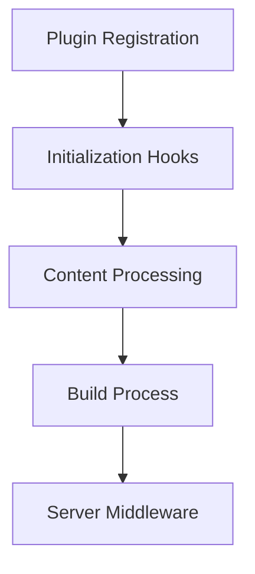
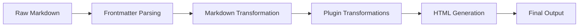
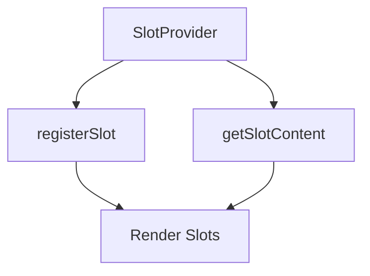
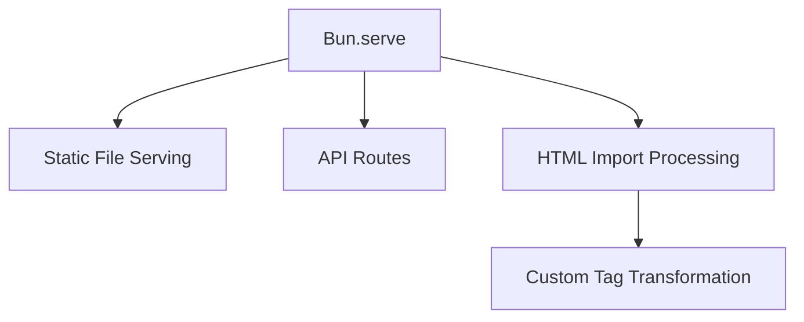
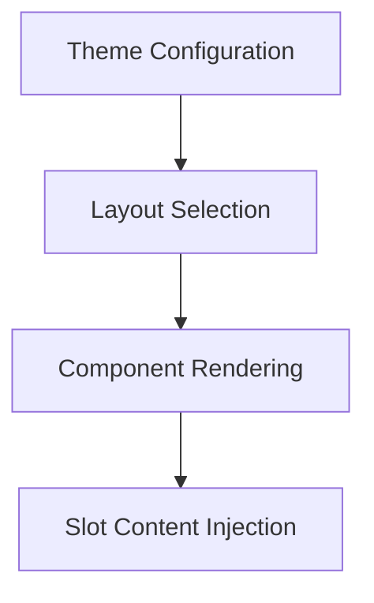
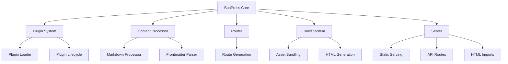

# System Patterns

## Architecture Overview

BunPress follows a modular architecture with clear separation of concerns:

```
src/
├── core/ - Core system components
├── plugins/ - Plugin implementations
├── cli/ - Command line interface
├── templates/ - Default templates
└── utils/ - Shared utilities
```

## Key Technical Decisions

### 1. Plugin Architecture
BunPress uses a lifecycle-based plugin system that allows extending the core functionality:



Each plugin can hook into multiple lifecycle stages:
- `onInit` - Plugin initialization
- `onContent` - Content transformation (Markdown -> HTML)
- `onBuild` - Build-time processing
- `onServer` - Server-side middleware

Plugins are registered in the BunPress configuration and loaded at runtime using the plugin loader system.

### 2. Content Processing Pipeline
Content processing follows a transformation pipeline pattern:



Key components:
- `ContentProcessor` handles the overall pipeline
- `markdownProcessor` transforms Markdown to HTML
- Plugins provide transformations via `onContent` hooks
- Slot system determines content placement in templates

### 3. Slot System
The slot system enables content injection into different areas of the page:



Component hierarchy:
- `SlotProvider` establishes the slot context
- `Slot` components register themselves in the context
- Content can be injected into slots by name
- Default content is used when a slot has no injected content

### 4. Fullstack Capabilities
BunPress combines static site generation with server capabilities:



The fullstack server supports:
- Static file serving for assets
- API routes via file-based routing
- HTML imports with custom `<import-html>` tags
- Middleware for request/response transformation

### 5. Theme System
The theme system provides customizable layouts and components:



Components include:
- `DocLayout` for documentation pages
- `HomeLayout` for landing pages
- `PageLayout` for general content
- Navigation components
- Sidebar components with collapsible sections
- TOC with active section highlighting

## Design Patterns in Use

1. **Factory Pattern**
   - Plugin instantiation via the plugin loader
   - Layout selection based on frontmatter

2. **Observer Pattern**
   - Plugin lifecycle hooks
   - Content change listeners for HMR

3. **Chain of Responsibility**
   - Content processing pipeline
   - Middleware chain in the server

4. **Provider Pattern**
   - Slot system with context provider
   - Theme provider for styling context

5. **Builder Pattern**
   - Configuration builder from user options
   - Content processor building content objects

## Component Relationships



## Performance Considerations

1. **Development Mode**
   - HMR for instant feedback
   - On-demand content processing
   - In-memory caching for processed content

2. **Build Process**
   - Parallel content processing where possible
   - Asset optimization
   - Tree-shaking for used components only

3. **Production Mode**
   - Pre-rendered HTML for fast initial load
   - Optimized asset loading
   - Client-side hydration for interactivity

## Error Handling Strategy

BunPress implements a multi-level error handling approach:

1. **Validation**
   - Configuration validation
   - Content format validation
   - Plugin compatibility checking

2. **Error Recovery**
   - Graceful fallbacks for missing components
   - Default content for missing slots
   - Plugin isolation to prevent cascading failures

3. **Error Reporting**
   - Detailed error messages with context
   - Dev server overlay for immediate feedback
   - Build-time error summaries

## Technical Constraints

1. **Bun Compatibility**
   - Designed specifically for Bun runtime
   - Leverages Bun.serve for the server
   - Uses Bun's bundler capabilities

2. **React Integration**
   - React for UI components
   - Server components for SSR
   - Client components for interactivity

3. **Markdown Processing**
   - markdown-it for primary processing
   - Plugin extensions for advanced formatting
   - Frontmatter for metadata
