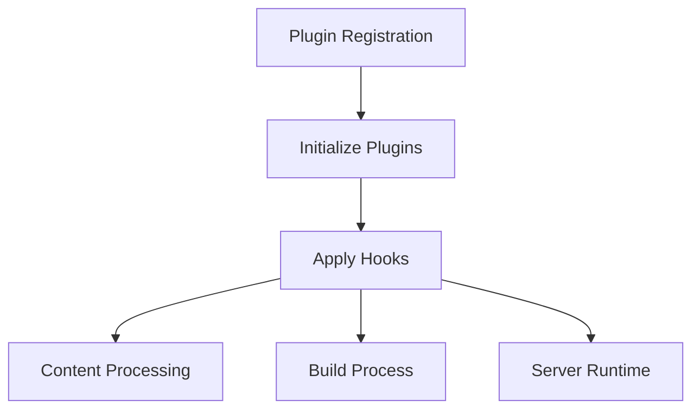
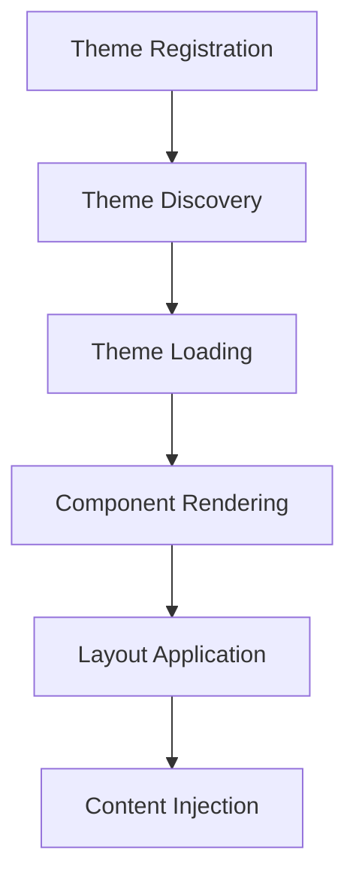
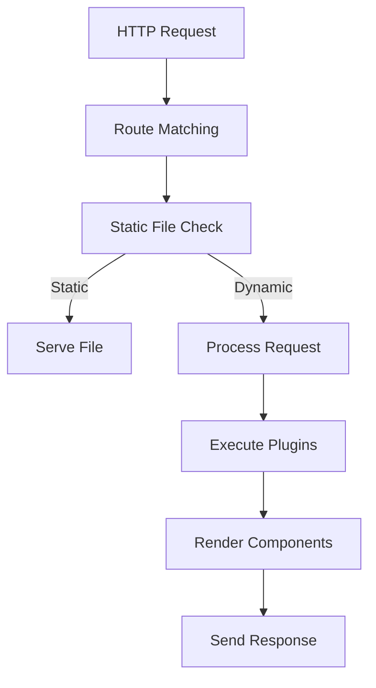
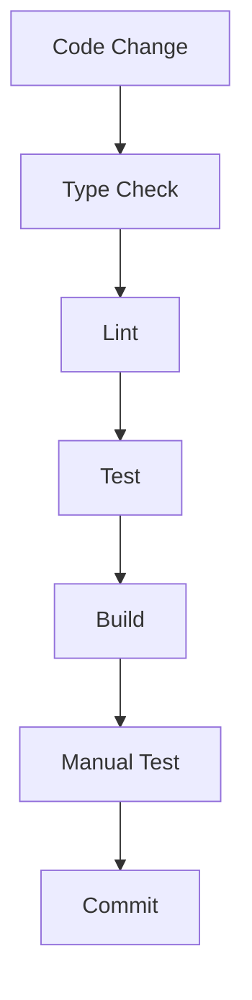

# BunPress Technical Context

## Technology Stack

| Category                | Technologies                                                   |
|-------------------------|---------------------------------------------------------------|
| **Core Framework**      | Bun.js + React.js                                             |
| **Build System**        | Bun's bundler + custom build pipeline                         |
| **Templating**          | React Server Components                                       |
| **Styling**             | CSS Modules                                                   |
| **Content Processing**  | Markdown-it with custom plugins                               |
| **Testing**             | Bun test (Jest-compatible API)                                |
| **TypeScript**          | Strict mode with custom configurations                        |
| **Package Management**  | Bun's package manager                                         |
| **Linting/Formatting**  | ESLint + Prettier                                             |
| **CI/CD**               | GitHub Actions                                                |

## Development Tools

| Tool             | Purpose                                              | Configuration                                        |
|------------------|------------------------------------------------------|------------------------------------------------------|
| **Bun**          | Runtime, bundler, package manager, test runner       | `bunfig.toml`                                        |
| **TypeScript**   | Type checking, static analysis                       | `tsconfig.json`                                      |
| **ESLint**       | Code quality, enforcing patterns                     | `.eslintrc.js`                                       |
| **Prettier**     | Code formatting                                      | `.prettierrc`                                        |
| **VS Code**      | Primary development environment                      | `.vscode/settings.json`, `.vscode/extensions.json`  |
| **Knip**         | Find unused files, exports, dependencies             | `knip.json`                                          |

## Project Structure

```
bunpress/
├── src/                  # Core source code
│   ├── cli/              # Command-line interface
│   ├── build/            # Build system
│   ├── server/           # Server implementation
│   ├── content/          # Content processing
│   ├── plugin/           # Plugin system
│   ├── theme/            # Theme system
│   ├── utils/            # Utility functions
│   └── integrated/       # Integration tests
│       └── __tests__/    # Test files for integrated systems
├── app/                  # Application components
│   ├── components/       # UI components
│   ├── themes/           # Built-in themes
│   └── layouts/          # Layout templates
├── public/               # Static assets
├── docs/                 # Documentation
├── scripts/              # Build and utility scripts
├── tests/                # Test utilities and configs
└── memory-bank/          # Project documentation and context
```

## Build Pipeline

1. **Source Processing**:
   - TypeScript compilation with declaration file generation
   - JSX transformation
   - Path resolution and module mapping

2. **Asset Handling**:
   - Image optimization and processing
   - Static file copying
   - Font processing

3. **Content Processing**:
   - Markdown parsing and transformation
   - Frontmatter extraction
   - Table of contents generation

4. **Bundle Creation**:
   - Dependency resolution
   - Code splitting
   - Tree shaking for unused code removal
   - Output generation

5. **Output**:
   - HTML generation
   - CSS processing and minification
   - JavaScript bundling
   - Static assets copying

## Key Architectural Concepts

### Plugin Architecture

The plugin system is the backbone of BunPress, allowing for extensibility and customization. Plugins hook into different stages of the build and runtime processes:



Plugins implement a standard interface with lifecycle methods:
- `onInit`: Called when the plugin is first loaded
- `onBuild`: Called during the build process
- `onServer`: Called when the server starts
- `onContent`: Called for each content file

### Theme System

Themes are implemented as React components with a specific structure:



Each theme consists of:
- Layout components (e.g., `DocLayout`, `HomeLayout`)
- Navigation components
- Style definitions
- Theme configuration

### Server Architecture

The server is built on Bun's HTTP server capabilities with React Server Components:



## Testing Strategy

### Test Types and Organization

BunPress employs multiple testing strategies to ensure code quality:

1. **Unit Tests**:
   - Located alongside source files in `__tests__` directories
   - Test individual functions and components in isolation
   - Use mock objects to avoid external dependencies

2. **Integration Tests**:
   - Located in `src/integrated/__tests__/`
   - Test interactions between multiple components
   - Often create temporary directories and files programmatically

3. **Theme Tests**:
   - Test theme loading and rendering
   - Verify component composition and layouts
   - Check responsive behavior

4. **Plugin Tests**:
   - Verify plugin registration and discovery
   - Test lifecycle hook execution
   - Validate plugin configuration

5. **CLI Tests**:
   - Test command execution and output
   - Verify project initialization and build processes
   - Check error handling and messaging

### Test Isolation and Best Practices

To ensure reliable and consistent tests:

- **Programmatic File Creation**: Tests create their own temporary files and directories instead of relying on existing files in the repository.
- **Cleanup**: Tests clean up after themselves to prevent test pollution.
- **Mocking**: External dependencies are mocked to avoid network requests and file system dependencies.
- **Global State Reset**: Any global state is reset between tests.
- **Simplified Assertions**: Complex tests with external dependencies are simplified to focus on core functionality.

Example of programmatic file creation pattern:
```typescript
// Create temporary directories for tests
const tmpDir = await makeTempDir();
const contentDir = path.join(tmpDir, "content");
await mkdir(contentDir, { recursive: true });

// Write test files
await writeFile(path.join(contentDir, "test.md"), "# Test Content");

// Run test
try {
  // Test assertions here
} finally {
  // Clean up
  await rm(tmpDir, { recursive: true, force: true });
}
```

### TypeScript in Tests

The project uses strict TypeScript configuration in tests with specific patterns:

- **Unused Parameters**: Prefix unused parameters with underscore (e.g., `_unusedParam`) to avoid TypeScript warnings.
- **Explicit Return Types**: Specify return types for functions to ensure type safety.
- **Mock Typing**: Provide explicit types for mock functions and objects.
- **Assertion Types**: Use type assertions judiciously to help TypeScript understand test expectations.

## Development Workflow



### Available Commands

| Command               | Description                                        |
|-----------------------|----------------------------------------------------|
| `bun run dev`         | Start development server                           |
| `bun run build`       | Build for production                               |
| `bun run test`        | Run all tests                                      |
| `bun run lint`        | Run linter                                         |
| `bun run typecheck`   | Run TypeScript type checking                       |
| `bun run clean`       | Clean build artifacts                              |
| `bun run deepclean`   | Remove all generated files and directories         |

## Core Technologies

### Bun

Bun is used as the project's runtime, package manager, and build tool. It provides:

- Fast JavaScript/TypeScript runtime
- Built-in bundler with tree shaking
- Jest-compatible test runner
- NPM-compatible package manager

### React.js

React is used for both client and server components:

- React Server Components for initial rendering
- Client components for interactive elements
- Hook-based state management
- Context API for theme and plugin state sharing

### TypeScript

TypeScript provides type safety and developer tooling:

- Strict mode for maximum type safety
- Interface definitions for plugins and themes
- Generic types for reusable components
- JSDoc comments for inline documentation

The project uses the following TypeScript configuration patterns:

```typescript
// For unused parameters
function exampleFunction(_unusedParam: string, usedParam: number): void {
  console.log(usedParam);
}

// For optional parameters with defaults
function configurePlugin(options: PluginOptions = {}): Plugin {
  // Implementation
}

// For type guards
function isMarkdownFile(file: File): file is MarkdownFile {
  return file.extension === '.md';
}
```

## Required Tools

To work on BunPress, you need:

- **Bun** (v1.0.9 or later)
- **Node.js** (v18 or later for compatibility tools)
- **Git** (for version control)
- **VS Code** (recommended editor)

## Recommended VSCode Extensions

- ESLint
- Prettier
- TypeScript and JavaScript Language Features
- Markdown All in One
- Mermaid Preview
- Jest Runner
- Path Intellisense

## Technical Constraints

### Performance Goals

- Initial page load < 1s
- Build time < 10s for small sites
- SSG output optimized for minimal JS payload
- Responsive design with mobile-first approach

### Browser Support

- Modern evergreen browsers (Chrome, Firefox, Safari, Edge)
- No IE11 support
- Progressive enhancement for older browsers

### Dependencies

- Minimal external dependencies
- Focused on Bun's built-in capabilities
- React as the primary UI library
- Markdown-it for content processing

## Technical Decisions

### Why Bun?

Bun was chosen as the primary runtime and build tool for its:

1. **Speed**: Significantly faster than Node.js for both runtime and building
2. **All-in-one solution**: Runtime, bundler, test runner, and package manager
3. **JavaScript/TypeScript support**: First-class support for both languages
4. **React compatibility**: Works well with React Server Components
5. **Modern APIs**: Provides modern APIs and capabilities

### Why React?

React was chosen as the UI library for its:

1. **Component model**: Excellent for building theme components
2. **Server Components**: Enables server-rendered content with hydration
3. **Ecosystem**: Large ecosystem of libraries and tools
4. **Developer experience**: Excellent DX with TypeScript
5. **Performance**: Good performance characteristics for SSG sites

### Why TypeScript?

TypeScript was chosen for type safety and developer experience:

1. **Type safety**: Catches errors at build time
2. **Developer tooling**: Excellent IDE integration
3. **Documentation**: Types serve as documentation
4. **Refactoring**: Makes refactoring safer and easier
5. **Interface definitions**: Clearly defines plugin and theme interfaces

### Why Markdown-it?

Markdown-it was chosen as the content processor for its:

1. **Plugin system**: Extensible with custom plugins
2. **Performance**: Fast parsing and rendering
3. **Compliance**: GFM compatibility
4. **Customization**: Fine-grained control over rendering
5. **Active maintenance**: Well-maintained and stable

## Common Pitfalls

### Path Handling

- Windows vs. POSIX path separators can cause issues
- Always use `path.join()` for cross-platform compatibility
- Be careful with absolute vs. relative paths

### React Server Components

- Not all React features are available in Server Components
- Client components must be explicitly marked with `'use client'`
- State management differs between Server and Client components

### Plugin System

- Circular dependencies can cause plugin registration issues
- Plugin execution order matters
- Plugin hooks must be pure or clearly document side effects

### Build System

- Build order is important for proper dependency resolution
- Caching can cause stale builds if not properly invalidated
- Environment variables can affect build output

## Project Health Metrics

- **Test Coverage**: >90% for core modules
- **Bundle Size**: <100KB for initial load
- **Build Time**: <10s for standard project
- **Startup Time**: <500ms for development server
- **TypeScript**: 0 type errors in strict mode